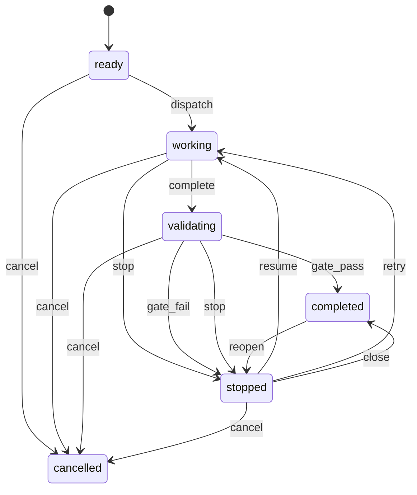

# Ouvrage — Task Lifecycle

How a task moves from dispatch to completion. The finite state machine, the side-effect declarations, the gate pipeline, crash recovery, and how the current shape evolved out of an earlier design with scattered state writes.

---

## Why this exists

A task is a long-running autonomous process. It spawns a Claude Code session, runs tests, launches subtasks, pushes branches, waits for human input, retries under failure, and sometimes dies mid-flight when the host reboots or the API rate-limits. Every one of those transitions has side effects that have to happen in the right order: post a message, write an audit row, clean up a worktree, notify Slack, dispatch a dependent.

The first implementation had these writes scattered across the dispatch module, each handler updating status directly and firing side effects inline. It worked until it didn't — a SIGTERM mid-dispatch left a task marked `working` with no live process. A credential-validation failure set status but skipped the notification. The divergence between what the row said and what actually happened got harder to trace with every new failure mode.

This document describes what that code became after the refactor: a single state machine that owns every status transition, with side effects declared per-transition instead of written per-handler.

## Goals / Non-goals

**Goals:**

- One call path for every status change: `TaskLifecycle.execute(task_id, action)`.
- Declarative transitions: the table says what's legal, what runs before, what runs after.
- Survive restarts. A task mid-flight when the service dies comes back to a known state on startup.
- Handle the gate pipeline as a loop: failures re-dispatch with feedback injected; retries cap.
- Chain tasks. Dependents dispatch when their parent's gate passes; invalidate downstream when a parent retries.

**Non-goals:**

- General-purpose workflow engine. The state machine is shaped for Claude Code dispatch. Temporal and Airflow solve different problems.
- Distributed consensus. Single-process, single-writer. Concurrency is cooperative via per-task asyncio locks.
- Zero-downtime migration between state-machine versions. Transitions are stable; state-schema changes require a migration and a restart.

## The six core states

The DB stores six statuses. Every other label the dashboard shows (`testing`, `reviewing`, `needs-review`, `turns-exhausted`, `blocked`, `queued`, `held`) is derived from these six plus a few task flags.

| State | Meaning |
|---|---|
| `ready` | Task exists, not yet running. May be held, queued, or blocked on a dependency. |
| `working` | A Claude Code session is active. |
| `validating` | Gate pipeline is running — test gate, review gate, or both. |
| `stopped` | Paused. User action, timeout, gate failure, credential issue, or needs-review signal. Resumable. |
| `completed` | Finished. Gates passed (if configured) or manually closed. Terminal but reopenable. |
| `cancelled` | Discarded before completion. Terminal. |

Six is load-bearing. Every earlier schema tried to stuff more — `needs-review`, `failed`, `turns-exhausted`, `rate-limited`, `reopened`, `merged` all lived in the status column. Collapsing them to six and pushing the richer labels into a `reason` field plus derived display logic simplified the transition table from ambiguous (`(failed, stop)` vs `(needs-review, stop)`) to single-keyed (`(stopped, resume)`).

The six states plus their principal transitions:



The diagram shows 15 transitions; the full table has 65. The rest are specialized actions that would clutter the shape without teaching it: `held`-toggling (`ready → ready` via `approve` / `hold`), `skip_gate` (manual gate bypass), the system-initiated recovery transitions (`recover_resume`, `recover_retry`, `recover_fail`), and the gate sub-machine that cycles `gate_status` through `testing → test-passed → reviewing` inside the `validating` state.

## The transition table

The contract lives in a single module-level dict.

```python
TRANSITIONS: dict[tuple[str, str], TransitionDef] = {
    ("ready", "dispatch"): TransitionDef(
        to_state="working",
        label="Dispatch",
        style="primary",
        side_effects=[_dispatch_launch_session],
    ),
    ("working", "complete"): TransitionDef(
        to_state="validating",
        reason="awaiting_gates",
        side_effects=[_record_completion, _start_gate_pipeline],
    ),
    ("validating", "gate_pass"): TransitionDef(
        to_state="completed",
        reason="gate_passed",
        side_effects=[_post_success_message, _dispatch_dependents, _maybe_create_pr, _finalize_attempt],
    ),
    ("validating", "gate_fail"): TransitionDef(
        to_state="stopped",
        reason="gate_failed",
        side_effects=[_post_fail_message, _finalize_attempt],
    ),
    # ... 61 more
}
```

65 entries total. Each entry keyed by `(current_state, action)` and valued by a `TransitionDef` dataclass.

`TransitionDef` fields:

- `to_state: str | Callable` — target state, possibly resolved dynamically from context (e.g. a cancel from `working` vs `validating` targets different states).
- `reason: str | Callable | None` — the descriptive label paired with the state. Powers display states: `("stopped", "needs_review")` renders as "Needs Review" on the dashboard.
- `preconditions: list[Callable]` — validations run before the transition. An exception from any precondition blocks the transition and surfaces to the caller.
- `side_effects: list[Callable]` — async functions run after the DB write. Exceptions are logged but don't raise; side-effect failures don't roll back the state change.
- `label`, `style`, `confirm` — dashboard presentation fields. The UI introspects `TRANSITIONS` to render action buttons; no separate config.
- `user_action: bool` — whether the transition is user-visible. System-initiated transitions (gate completion, recovery) are hidden from the action menu.

Lookups are single-keyed. If `(current_state, action)` isn't in the dict, `IllegalTransition` raises with a list of actions that *are* legal for the current state. Calling code never guesses.

## Execute as the single owner

Every status change goes through one method.

```python
async def execute(self, task_id: str, action: str, **context) -> dict:
    async with self._lock_for(task_id):         # per-task asyncio lock, reentrant
        task = await db.get_task(task_id)
        state = _effective_state(task)           # map raw status to core 6
        tdef = TRANSITIONS[(state, action)]     # raises IllegalTransition if missing

        for check in tdef.preconditions:
            await check(task, **context)         # raises to block transition

        new_state, reason = tdef.resolve_target(task, **context)
        await db.update_task(task_id, status=new_state, reason=reason)
        await audit.write(task_id, action, state, new_state, reason, context)

    for effect in tdef.side_effects:
        try:
            await effect(updated_task, **context)
        except Exception:
            logger.exception("side effect failed for task %s action %s", task_id, action)

    return await db.get_task(task_id)
```

Three invariants the method enforces:

1. **Single DB write for status.** One `update_task(status=...)` per transition. Side effects may write other columns; they never write status directly.
2. **Per-task serialization.** A reentrant asyncio lock per task_id prevents interleaved transitions. A recovery loop and a user-initiated cancel don't race — they queue.
3. **Audit row before side effects.** The audit log is written inside the lock, before side effects run. If a side effect crashes, the audit record still shows the transition happened.

The method is ~130 lines. The dispatch module around it is ~1,800 more — 47 private side-effect functions, 35 `STATE_LABELS` entries, the effective-state resolver, the recovery entry points. All of it is addressable from the transition table: a new feature that needs a state change adds an entry to `TRANSITIONS` and implements the side-effect functions it references.

**Invariant status:** the single-owner rule is enforced by convention and review, not by a runtime check. A grep for `update_task.*status=` across the dispatch module today finds five call sites outside `lifecycle.py` — in `pr_sweep.py` (PR-merge detection) and `git/operations.py` (auto-merge error paths). Those are known violations, flagged for follow-up. Every other status change in the system goes through `execute()`.

## Display states are derived

The dashboard shows richer labels than the six core states. None of those labels are stored. They're computed at read time.

```python
def _effective_ready_reason(task) -> str | None:
    if task["held"]:              return "held"
    if task["queued_at"]:         return "queued"
    if task["dependency_unmet"]:  return "blocked"
    return None

STATE_LABELS: dict[tuple[str, str | None], dict] = {
    ("ready", None):                     {"label": "Ready",       "color": "#6b7280"},
    ("ready", "held"):                   {"label": "Held",        "color": "#f59e0b"},
    ("ready", "queued"):                 {"label": "Queued",      "color": "#9ca3af"},
    ("ready", "blocked"):                {"label": "Blocked",     "color": "#6b7280"},
    ("validating", "testing"):           {"label": "Testing",     "color": "#8b5cf6", "pulse": True},
    ("validating", "reviewing"):         {"label": "Reviewing",   "color": "#8b5cf6", "pulse": True},
    ("stopped", "needs_review"):         {"label": "Needs Review","color": "#f5a623"},
    ("stopped", "turns_exhausted"):      {"label": "Turns Out",   "color": "#f5a623"},
    ("stopped", "credential_failed"):    {"label": "Pre-flight Failed", "color": "#ef4444"},
    # ... 35 entries
}
```

The dashboard looks up `(effective_state, reason)` and renders the label. The effective state handles legacy status values from migrations (`needs-review`, `turns-exhausted`, `failed`, `merged`, `rate-limited`, `reopened`) by mapping them to core states with appropriate reasons. New code writes only core states; old rows read correctly.

The `held` flag deserves a specific mention. `held` is a boolean on `ready` tasks, not a status. A held task is `status='ready', held=true`. Dashboard renders it as "Held". Transitions `(ready, approve)` and `(ready, hold)` toggle the flag. Treating held as a state value would have doubled the transition table; a flag with derived display is one row, one column, clean.

## The gate pipeline

When a worker finishes, the task transitions `working → validating`. What runs inside validating depends on project configuration.

```
CC completes → (working, complete) → validating
                                        │
                          auto_test enabled on task?
                                        │
                  ┌─────────────────────┴─────────────────────┐
                yes                                          no
                  │                                           │
                  ▼                                           ▼
    gate_status = "testing"                      skip to review (if configured)
    project.test_command runs                    or straight to gate_pass
    output → last_test_output
                  │
      ┌───────────┼──────────────────┐
      │           │                  │
   exit 0     exit ≠ 0           exit ≠ 0
      │        (under cap)       (at cap)
      │           │                  │
      │     re-dispatch worker       │
      │     with test output         │
      │     injected → working       │
      │     (retry the task)         │
      ▼                              ▼
  review configured?            gate_fail → stopped
      │                         (reason: max_test_retries)
      ▼
      │  ┌────────────────┐
      ├──┤  auto_review   │
      │  │   enabled?     │
      │  └────────────────┘
      │           │
      │    ┌──────┴──────┐
      │   yes           no
      │    │             │
      │    ▼             ▼
      │  dispatch    gate_pass → completed
      │  review
      │  subtask
      │    │
      │    ▼
      │  APPROVED / CHANGES REQUESTED
      │    │
      │    ├─ APPROVED   → gate_pass → completed
      │    ├─ CHANGES    → under cap: re-dispatch worker
      │    │              with review feedback
      │    │              injected → working (retry)
      │    └─ CHANGES    → at cap: gate_fail → stopped
      │                    (reason: max_review_retries)
```

Both gates are optional per task. `auto_test=false` skips the test gate entirely; `auto_review=false` skips the review gate. A task with neither enabled goes straight to `gate_pass` on worker completion. Every failure under the retry cap re-dispatches the worker with the failure text (test stdout or reviewer feedback) injected verbatim into the next prompt; hitting the cap stops the task for human decision.

**Test gate.** Runs `project.test_command` in the worktree as the worker user. Stores `{exit_code, stdout_tail, ran_at, attempt}` in the task's `last_test_output` column. On fail, checks `task.max_test_retries` (default 3). Under cap: re-dispatches the worker with the failure text available in the task thread for the retry's context. At cap: `gate_fail → stopped`.

**Review gate.** Dispatches a separate Claude Code subtask (new session, same worktree) with a review prompt that includes the spec, course corrections from the user, and prior review history. The reviewer runs until it posts an `APPROVED` or `CHANGES REQUESTED` message, then exits. Retry cap default: 2. Under cap on `CHANGES REQUESTED`: re-dispatches the worker with the review text injected into the next prompt. At cap: `gate_fail → stopped`.

**Feedback injection.** When a retry dispatches after a gate fail, the worker prompt builder pulls the last review message and test output and includes them verbatim in a "⚠️ REVISION REQUESTED" block at the top of the prompt. No summarization, no interpretation — raw text. The retry is a session resume (`options.resume = session_id`), so the full conversation history is preserved; the injected feedback appears as new user context at the top.

**Pass path.** `gate_pass` from `validating → completed` fires `_dispatch_dependents`: queries tasks with `depends_on = this_task_id` and calls `lifecycle.execute(dependent_id, 'dispatch')` for each. Chains cascade naturally through the state machine without a separate scheduler.

**Chain invalidation.** When an upstream task retries (transitions back to `working` via resume or retry), downstream tasks are marked with a stale flag. On the parent's next successful gate pass, stale dependents are auto-rebased onto the updated parent branch and re-dispatched with context about what changed upstream.

## Crash recovery

The service can die. A VPS reboots, a process OOMs, Docker restarts. Tasks that were mid-flight need to come back to a known state.

**Detection.** On service start, `recover_orphaned_tasks()` finds every task in `working` whose recorded PID is dead or missing, plus every task in `validating` with a gate subtask that isn't running. A process-liveness check (`kill -0`) is cheap; all orphans surface in a single pass.

**Classification.** Orphans get a priority:

- Gate subtasks — parent is mid-gate, re-trigger the gate.
- Chain parents with waiting dependents — unblock the chain.
- Regular working tasks — resume or retry.

**Flap detection.** A `recovery_count` column increments on every recovery attempt. At `MAX_RECOVERY_ATTEMPTS` (3 by default), the task transitions to `stopped` with `reason='recovery_exhausted'` rather than re-dispatching. A task that keeps crashing isn't helped by more crashes.

**Stagger.** Recovery doesn't fire all orphans at once. Between orphans, the recovery loop waits `RECOVERY_STAGGER_SECONDS` (30s default) to avoid a thundering herd of Claude Code processes on startup.

**Stall detection.** A background loop checks working tasks every 60s. If an active SDK client has been idle for 300+ seconds, the loop posts a stall warning to the task thread — a signal visible in the dashboard and to any MCP client watching. There is deliberately **no auto-restart** on stall. The tradeoff: the SDK's idle signal isn't always reliable, and a worker that looks stalled may be in the middle of a long inference or a subprocess that hasn't yielded. Killing a working worker at scale burns real budget and discards in-progress work. A human sees the warning, opens the task, and decides whether to resume, retry, or cancel — all through the dashboard or the equivalent MCP calls. Automating restart is open for reconsideration, but not until the SDK's progress reporting is reliable enough to distinguish "genuinely stuck" from "slow to respond."

Tasks with no active client (the service restarted, the process died) are a different case — those are orphans, classified by the recovery entry point above.

Recovery always goes through the state machine. `lifecycle.execute(task_id, 'recover_resume')` or `'recover_retry'` or `'recover_fail'` — each has its own entry in `TRANSITIONS`, its own preconditions, its own side effects.

## Queue and concurrency

A simple FIFO drain, stored in the database (not in memory).

**Limit.** `concurrency_limit` defaults to 6, stored in `instance_config`. Overridable per-instance.

**Dispatch under load.** When a new task tries to dispatch and the count of `working` tasks is at the limit, the task transitions to `ready` with `queued_at = now`. A background drain loop polls every few seconds and dispatches the oldest queued task when a slot frees up.

**Priority.** FIFO by `queued_at` for regular queueing. Recovery tasks set `recovery_priority = true` to jump the queue — a VPS restart that leaves five working tasks orphaned should recover them before processing new user-submitted work.

## The `transition_task` tool

The MCP surface for lifecycle operations consolidates behind a single tool rather than spreading across `start_task`, `stop_task`, `pause_task`, `resume_task`, `cancel_task`.

```
transition_task(task_id, action, **context)
  actions: dispatch, resume, retry, reopen, start, stop, cancel, close,
           approve, skip_gate, hold
```

The tool is a thin wrapper around `lifecycle.execute()`. Collapsing the surface has two effects:

- **Prompt economics.** Workers and controllers see one tool definition, not eight. Less context-window load-bearing on tool selection.
- **Centralized authorization.** One entry point to check user/worker permissions, one audit log path, one place to reject malformed transitions.

Worker sessions don't call `transition_task` — they use callback tools (`post_task_message`, `update_task_checklist`, `update_task_phase`) and let the system drive transitions based on what they post and when they complete. A worker emitting a `type='result'` message in the right phase is the signal for `(working, complete)`; the dispatch engine issues the transition on the worker's behalf.

## Evolution — how the state machine got here

The refactor story is worth telling because the current shape isn't the first shape.

**Before.** Status writes were spread across the dispatch module. `dispatch_task` wrote `status='working'` after launching the session. The gate runner wrote `status='testing'` when it started and `status='test-passed'` or `status='test-failed'` when it finished. Cancellation had its own path. Recovery had its own path. Each handler fired whatever side effects it needed inline.

Three failure modes kept biting:

1. **Status and side effects could diverge.** A credential check failed before launching; the code set `status='held'` but forgot the audit log entry. Looking at the task later, it was held with no reason visible.
2. **Concurrent transitions raced.** A user cancelled a task while the gate pipeline was completing it. Depending on timing, the task ended `cancelled` with `gate_status='passed'`, or `completed` with a half-run cancel cleanup.
3. **Recovery had to reimplement transition logic.** The recovery path needed to know which state each orphan should move to and which side effects should run. It ended up duplicating the main dispatch code with slightly different error handling.

**The refactor.** Introduced April 1, 2026 with commit *"Add TaskLifecycle service with transition table, execute(), state labels, reason column"*. The initial implementation defined the `TRANSITIONS` dict, the `TransitionDef` dataclass, the `execute()` method, and the schema change adding the `reason` column. 27 valid transitions at first. Tests (~90 of them) covered the table directly — assert `(state, action)` is legal, assert the precondition raises, assert the side effect gets called.

**Strangler migration.** Same day, a follow-up commit migrated `cancel_task`, `close_task`, and `skip_gate` through the new service. Old handlers still existed; the new ones shadowed them. Over roughly a week, every dispatch handler got ported.

**Credential pre-flight fix.** April 8, 2026: *"Fix credential pre-flight to use lifecycle state machine instead of direct db.update_task"*. The credential validation layer had been one of the holdouts — it set `status='held'` directly on pre-flight failure. Moving it through `execute()` gave it a proper audit log, a side effect to post the reason to the task thread, and the right reason code for the dashboard display.

**What remained.** The five direct-write violations in `pr_sweep.py` and `git/operations.py` are known. They're reachable from specific auto-merge paths and haven't hit the failure modes that motivated the refactor elsewhere. Flagged for cleanup but not a live problem.

The refactor changed the cost of adding a new state transition. Before: grep for every handler that might write status, update each, remember the side effects, write tests for each handler. After: one row in `TRANSITIONS`, one side-effect function if needed, one test case. The table is the feature.

## Alternatives considered

- **Celery / RQ / Sidekiq.** Job queues with worker pools. Rejected because Ouvrage tasks aren't background jobs — they're long-running interactive sessions with human-in-the-loop gates and mid-task message injection. The queue model forces "work to completion" semantics; the state machine models "work with checkpoints."
- **State stored in Redis.** Faster status reads. Rejected because everything else (conversations, audit logs, task artifacts) is in SQLite; splitting the state across two stores split the transactional boundary. SQLite WAL gives enough concurrency for a single-operator system.
- **Stored procedures for transitions.** Push transition logic into the DB. Rejected because transition logic lives in Python (preconditions call other services, side effects spawn subprocesses). SQLite stored procs (via triggers) don't have the escape hatches.
- **Event sourcing.** Store every transition as an event, rebuild state by replay. The audit log already captures this de facto. Full event sourcing would have required a query layer to reconstruct current state for the dashboard. Not worth the complexity.
- **Separate state machines per domain (dispatch vs gates vs recovery).** Each has its own natural state model. Rejected because the three interact — a gate failure produces a dispatch-domain state change — and three machines with handoffs are fiddlier than one machine with more states.

## Tradeoffs

- **Single-writer DB.** SQLite WAL tolerates concurrent readers but serializes writers. At low write volume this is fine. A busier instance would contend.
- **Side-effect failures don't roll back.** A failed notification doesn't undo the state change. Notifications are eventually-consistent; the state is the source of truth. The audit log captures both the transition and any side-effect failures for forensics.
- **Retry cap is configurable per task, not adaptive.** The defaults (3 for tests, 2 for reviews) are settable at the system level, overridable at the project level, and overridable again per task via `max_test_retries` and `max_review_retries` columns. What's not built is an adaptive policy — fail fast for pre-flight errors, retry slowly for intermittent network issues. The cap is the cap.
- **Chain propagation is linear by design.** A task depends on one parent. Multi-parent convergence isn't modeled. The alternative — a task fanning out into parallel children that both branch off the parent and produce PRs that have to be merged back — was considered and rejected. At agentic speeds, two PRs landing simultaneously against the same parent branch produces tangles a human reviewer has to untangle. Linear chains keep review cognitive load low: one PR at a time, in a predictable order. When genuine parallelism is wanted, the right unit is *separate* chains running concurrently — two conceptually distant pieces of work progressing in parallel, not one piece fanning out. Separate chains share no branches and don't tangle.
- **Direct-write violations.** Five known spots in `pr_sweep.py` and `git/operations.py`. Each works today. Each is a liability if someone adds a new side effect and forgets to duplicate it in the direct-write path.
- **State is centralized.** Every feature that needs a state transition passes through `lifecycle.py`. The module is 1,800+ lines. Refactoring it into submodules is outstanding work; it's too big to navigate comfortably, not big enough to force the refactor yet.

## Cross-cutting concerns

- **Auth.** Status transitions triggered by users require the dashboard session. Transitions triggered by workers go through `/mcp/worker` (localhost bypass) with the worker's task-scoped context. System-initiated transitions (gate completion, recovery) bypass auth because they originate inside the process.
- **Observability.** Every `execute()` call writes an audit row: `{task_id, action, from_state, to_state, reason, triggered_by, timestamp, context_json}`. Queryable from the dashboard and through MCP (`list_attempts`, `get_dispatch_log`). Slack notifications fire as side effects on configured transitions.
- **Cost.** Every retry dispatches a new Claude Code session — tokens and seconds. The retry caps are deliberate: three test retries on a 200-turn worker at Opus pricing adds up quickly. Token usage is tracked per attempt and rolled up to the task.
- **Recovery idempotence.** Transitions are idempotent by key: the same `(state, action)` produces the same target state and side-effect list. Recovery is safe to run multiple times — a task that was already transitioned won't double-transition, and a transition that was mid-flight at crash time runs cleanly on retry.

## Riff points

- Six core DB states, 65 declared transitions, one `execute()` method. The transition table is the contract.
- Display states are derived. "Testing" is `validating` with `gate_status='testing'`. "Held" is `ready` with `held=true`.
- `TransitionDef` carries preconditions, side effects, label, style, user-visibility flag. The dashboard reads the same table for action buttons.
- Per-task asyncio lock keeps transitions serialized. Audit row is written inside the lock, before side effects.
- Gate pipeline as feedback loop: test failure text and review feedback are injected verbatim into retry prompts. No summarization.
- Chain propagation rides the state machine. `gate_pass` fires `_dispatch_dependents` as a side effect.
- Recovery goes through the state machine. `recover_resume`, `recover_retry`, `recover_fail` are transitions with their own preconditions.
- Flap detection caps recovery attempts — a task that keeps crashing doesn't get helped by more crashes.
- The refactor story: scattered direct writes → single-owner FSM in about a week. Credential pre-flight was the last holdout.
- Known debt: five direct-write violations in `pr_sweep.py` and `git/operations.py`. Tracked, not yet cleaned.
